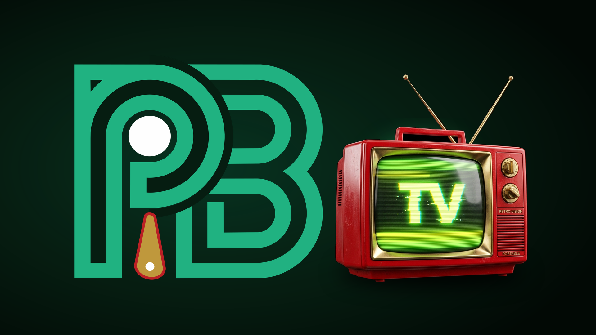

# Pinball Buddies Pincast TV — Native Ambient Arcade Signage

> 100% Native TV Application built with Kotlin, Jetpack Compose for TV, and Room SQLite offline caching.
> Turn any Amazon Fire TV Stick, Google TV, or Android TV device into a high-performance arcade leaderboard display.



---

## Why Native? (No Web Browsers)

Web browsers on TV hardware (like Silk or Smart TV browsers) suffer from high memory consumption, intrusive address bars, awkward cursor emulation, and frequent crashes.

**Pinball Buddies Pincast TV** is built as a pure **native TV application**:
- ⚡ **60fps Native Hardware Acceleration**: Smooth Compose for TV transitions and fluid slide carousels.
- 💾 **Room SQLite Offline Persistence**: Keeps showing your venue's latest scores and leaderboards even during internet blips.
- 🎮 **Full TV Remote Control**: D-Pad Left/Right manual cycling, D-Pad Center pause/resume, and Back button Operator PIN management.
- 🛡️ **Arcade Burn-In Protection**: Subtle micro-pixel drift (±2dp drift every 120s) protects arcade CRTs, OLEDs, and commercial LCDs from image retention.
- 📱 **6-Digit & QR Code Handshake**: Seamlessly pairs with your venue from the Pinball Buddies phone app.

---

## Hardware Compatibility

| Platform | Support Level | Implementation |
|---|---|---|
| **Amazon Fire TV Stick** | **Tier 1 (Native App)** | Sideload `pinball-buddies-pincast-tv.apk` (Fire OS 7/8) |
| **Google TV & Android TV** | **Tier 1 (Native App)** | Sideload `pinball-buddies-pincast-tv.apk` (Chromecast, Sony, Shield) |
| **Apple TV (tvOS)** | **Tier 1 (Native App)** | Native SwiftUI app (`ios/App/AppTV`) on TestFlight & App Store |
| **Raspberry Pi 4 / 5** | **Tier 1 (Native TV)** | Android TV / LineageOS 21 (KonstaKANG) with native APK |
| **Windows / Linux Mini-PCs** | **Tier 1 (Native)** | Android Subsystem (WSA / Waydroid) or Compose Desktop |

---

## Quick Start for Humans (2 Installation Methods)

### Method 1: Sideloading via "Downloader" App (No Computer Needed! 📱)
*Takes 60 seconds with just your Fire TV remote:*
1. Install the free **Downloader** app from the Amazon Appstore.
2. In Fire TV Settings: **My Fire TV > Developer Options > Install unknown apps > Downloader > ON**.
3. In Downloader, type the direct download link:
   `https://github.com/PBJonny/pincast-tv/releases/latest/download/pinball-buddies-pincast-tv.apk`
   *(or simply type **`pinballbuddies.com/tv`**)*
4. Click **Install**, launch the app, and scan the on-screen QR code from your phone to link your venue!
👉 *Read the full walkthrough in **[`HUMAN_INSTALL_GUIDE.md`](./HUMAN_INSTALL_GUIDE.md)**.*

---

### Method 2: Automated 1-Click Wi-Fi Installer (From Mac, Windows, or Linux)
*Installs the APK over Wi-Fi and configures 24/7 arcade kiosk power settings automatically:*
```bash
# macOS / Linux
./scripts/setup-firestick.sh 192.168.1.150

# Windows
.\scripts\setup-firestick.bat 192.168.1.150
```

---

## ⚡ Power-On & Boot Behavior (Startup Delay Explained)

> **Important Note for Staff & Operators**:
> When you power on your TV or turn on your arcade master power strip in the morning, Fire OS performs a cold boot and connects to the venue Wi-Fi network.
>
> ⏳ **There is an intentional 30–60 second startup delay timer** before the app launches.
> **The display is not frozen or broken!** 
> This delay guarantees that the Wi-Fi connection and HDMI display handshake are fully established before the app begins streaming live leaderboard scores.
> 
> 👉 **Do not press buttons on the remote.** Pinball Buddies Pincast will take over the display automatically!

---

## Expanding Past Fire Stick: Other Platforms

Wondering how our native code runs on Google TV, Apple TV, Raspberry Pi, or mini-PCs?
👉 Read our comprehensive architectural guide: **[`MULTI_PLATFORM_GUIDE.md`](./MULTI_PLATFORM_GUIDE.md)**.

- **Google TV & Android TV**: Uses the exact same `pinball-buddies-pincast-tv.apk`!
- **Apple TV (tvOS)**: Native SwiftUI target located in `ios/App/AppTV/` (`PinballBuddiesTV`).
- **Raspberry Pi 4 / 5**: Run LineageOS Android TV to run our native APK with full GPU acceleration.
- **Smart TVs (Samsung / LG)**: Plug a \$25 Fire Stick or Onn. Google TV into HDMI to bypass slow TV OS software.

---

## For AI Agents

Are you having an autonomous AI agent (Claude, Antigravity, OpenDevin, Cursor, or local LLMs) set up your display?
👉 Refer to **[`AI_AGENT_INSTALL_GUIDE.md`](./AI_AGENT_INSTALL_GUIDE.md)** for deterministic ADB commands, process validation, and error-handling matrices.

---

## Included Files in this Package

```
pincast/
├── pinball-buddies-pincast-tv.apk  # Signed production release APK (Fire OS & Android TV)
├── tv_banner.png                  # 1080p display banner artwork
├── README.md                      # Overview and quick-start guide
├── HUMAN_INSTALL_GUIDE.md         # Step-by-step human guide (Downloader & Wi-Fi)
├── AI_AGENT_INSTALL_GUIDE.md      # Deterministic playbook for AI agents
├── MULTI_PLATFORM_GUIDE.md        # Native multi-platform adaptation playbook
├── manifest.json                  # Release metadata & SHA-256 integrity hash
└── scripts/
    ├── setup-firestick.sh         # macOS/Linux automated native APK installer
    ├── setup-firestick.bat        # Windows automated native APK installer
    └── kiosk-power-settings.sh    # 24/7 ADB display sleep and power tuner
```

---

## Support & Resources

- **Website**: [https://pinballbuddies.com](https://pinballbuddies.com)
- **Support**: [support@pinballbuddies.com](mailto:support@pinballbuddies.com)
